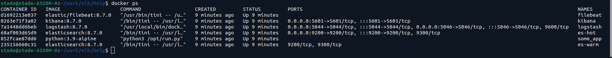
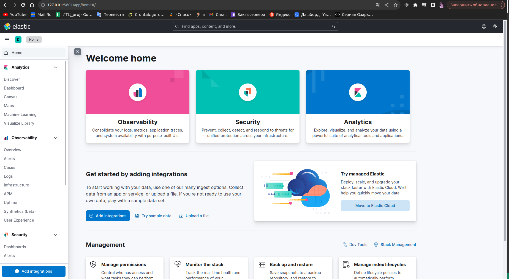
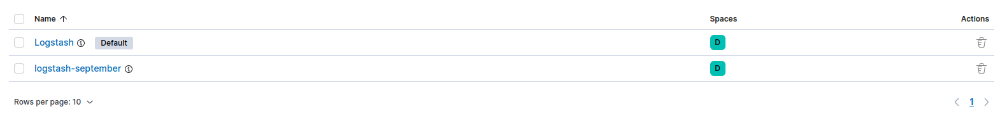
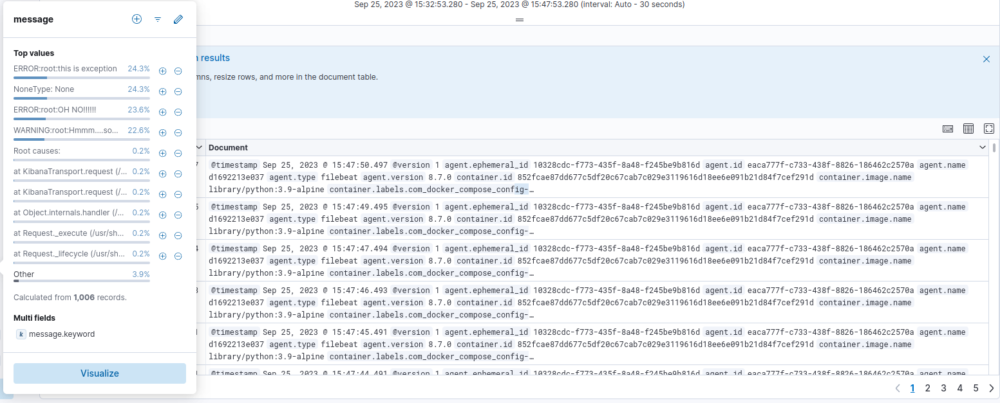
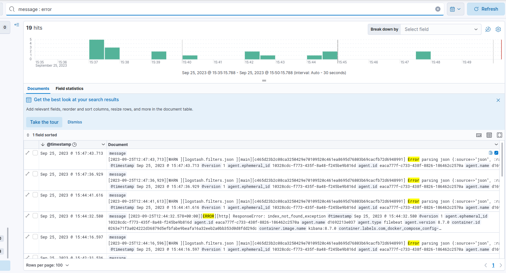

# Домашнее задание к занятию 15 «Система сбора логов Elastic Stack»

1. Cкриншот docker ps через 5 минут после старта всех контейнеров (их должно быть 5);

2. Интерфейс Kibana

3. Создать несколько индекс-паттернов из иммеющихся:

4. Отчет message_keywoard

Поиск KQL (error in message):

